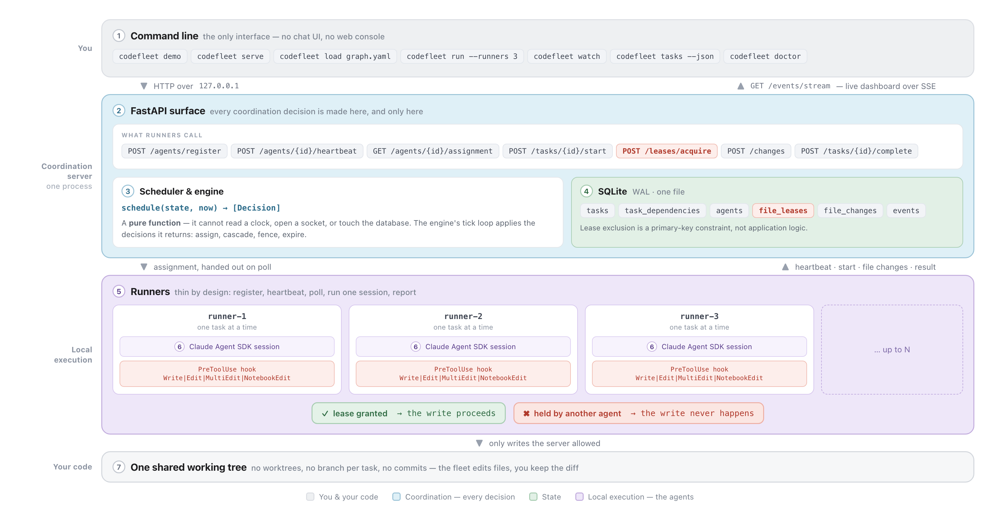

# CodeFleet

The file lock for parallel Claude coding agents.

[](https://github.com/ashnkumar/code-fleet/actions/workflows/ci.yml)
[](https://www.python.org/downloads/)
[](LICENSE)


A real run: five tasks, three agents, one tree. The red `VETO` is the moment two agents reached for
the same file — the second one was refused instead of overwriting it, and finished on retry. That is
a genuine race, so it does not fire on every live run; `--dry-run` makes the timing deterministic,
which is what CI asserts on.

## Quickstart

```bash
git clone https://github.com/ashnkumar/code-fleet && cd code-fleet
uv sync
export ANTHROPIC_API_KEY=sk-ant-...
uv run codefleet demo
```

Needs Python 3.12+ and [uv](https://docs.astral.sh/uv/). `uv sync` is the whole install — no Node, no
npm, no separate Claude Code install, because `claude-agent-sdk` ships the CLI as a bundled binary
(~245 MB, and most of the install time).

`codefleet demo` copies `examples/demo-repo` to a scratch workspace, runs three agents over a
five-task graph, and finishes by running that repo's own test suite. Your checkout is untouched. A
run costs about $0.20 and takes under a minute.

**No API key, or don't want to spend anything:**

```bash
uv run codefleet demo --dry-run
```

Same server, same scheduler, same leases, same veto — scripted agent sessions instead of real ones.
Free, deterministic, and what CI runs. If something looks wrong before you spend money, try
`uv run codefleet doctor`.

## What you get

One command, a task list, and as many agents as you want to run. When the fleet drains, every task's
changes are in a single working tree, applied in dependency order, and you run the tests once. Nobody
relayed a completion signal or assigned the next batch.

| | Doing this yourself | With CodeFleet |
|---|---|---|
| **Branches** | Five worktrees to merge, or five PRs to triage | One tree. There is nothing to merge |
| **Conflicts** | Two agents edited the same file and you arbitrate the diff | The second write is refused outright, not reconciled afterwards. That task re-runs once the file is free |
| **Wasted runs** | The agent that lost the race did a whole task that gets discarded or hand-merged | It is blocked at its first contended write rather than after a full run, and retries against real code |
| **Ordering** | You start task B too early against a half-finished tree, or serialize everything | The server holds the dependency graph and releases each task as it unblocks |
| **Crashes** | A runner dies holding work and you notice eventually | A missed heartbeat fences it and requeues its task |

The obvious alternative is a worktree per agent, and when you want independent branches and a human
reviewing PRs, it is the right one. It trades a write-time collision for a merge-time one: both agents
finish, one of them was working against a copy that went stale halfway through, and somebody
reconciles the diff afterwards. CodeFleet takes the other trade. It serializes agents on a contended
file so the second one starts *after* the first has released it, and reads real code instead of
conflict markers. You lose parallelism on the files two agents both want, and a blocked task pays for
however much of its run it had already done. What you never do is reconcile two versions of the same
file.

## How it works


- **Runners are deliberately thin.** Register, heartbeat, poll for an assignment, run one session,
  report the result. They hold no queue, evaluate no dependencies, and decide nothing about who does
  what. All of that is server-side, in one place, where you can read it.
- **The scheduler is a pure function.** `schedule(state, now) -> list[Decision]` takes a frozen
  snapshot and returns what should happen. It cannot read a clock, open a socket, or touch the
  database — the server applies what it returns. That is why its tests build state literally and need
  no fixtures, no event loop, and no database.
- **Leases are per file and lazy**, acquired at the first write rather than up front from a declared
  scope. A denial is an immediate veto, never a wait, so no agent ever holds one lease while waiting
  on another.

### Architecture



| # | Component | Module | What it does |
|---|---|---|---|
| **1** | Command line | `cli.py` | The only interface. No chat UI, no web console |
| **2** | HTTP surface | `server.py` | Every coordination decision, plus the SSE stream the dashboard reads |
| **3** | Scheduler & engine | `scheduler.py`, `engine.py` | `schedule(state, now) -> [Decision]`, pure; the engine's tick loop applies what it returns |
| **4** | State | `store.py`, `schema.sql` | SQLite in WAL mode. Lease exclusion is a primary-key constraint, not application logic |
| **5** | Runners | `runner.py` | Thin: register, heartbeat, poll, run one session, report |
| **6** | Agent session | `session.py` | The only module that imports `claude_agent_sdk`, and where the hook is installed |
| **7** | Working tree | your code | One shared checkout. The fleet edits files; you keep the diff |

Start with `src/codefleet/scheduler.py`. It is the core of the whole thing and it is 337 lines.

## The veto

Before any agent writes, a `PreToolUse` hook matched on `Write|Edit|MultiEdit|NotebookEdit` asks the
server for a lease on the path. If another agent holds it, the hook returns
`permissionDecision: "deny"` and **that write never happens**. The denied agent is told who holds the
file, and its task is requeued with the contended path folded into its file scope — so the scheduler
runs it after the holder releases rather than rolling the dice again.

Only half of that is enforced. A denied tool call does not execute, and that part is the CLI rather
than the model's cooperation. What the agent does *next* is its own business: the deny carries no
stop signal, so a session can keep going and reach for a different file. It gets the same answer on
anything else that is held. The guarantee is per write, not per session, and per write is what the
scheduling actually rests on.

Two more obvious APIs were rejected first, each for a reason you can re-check against the SDK:

| Rejected | Why |
|---|---|
| `can_use_tool` | Looks right — a permission callback the host controls. But it requires streaming-input mode, and it is *shadowed* by `permission_mode="bypassPermissions"` and by every whole-tool entry in `allowed_tools`. The SDK emits a `CanUseToolShadowedWarning` that points you at `PreToolUse` itself. |
| `permission_mode="acceptEdits"` | It auto-accepts file edits, but leaves every other tool on the standard permission path, which prompts — and an unattended runner has nobody to answer a prompt. It also buys nothing back: the deny still has to arrive as a `PreToolUse` hook either way, since that is the only place the server's answer can reach a tool call before it runs. |
| `permission_mode="bypassPermissions"` | Stops the prompting, and approves everything that reaches the permission step. The SDK docs say to use it *"with extreme caution"* — reasonably, since it means full system access. `dontAsk` buys the same freedom from prompts by denying what it wasn't told about instead of approving it. |

The session runs `permission_mode="dontAsk"` with `allowed_tools` naming those same seven tools.
Nothing prompts, and anything that is *not* on the list — a tool from the target repo's own
`.mcp.json`, a plugin, a settings file — is refused rather than run.

**The cost of that choice.** The mode decides whether a *tool* may run; only the hook knows whether
this agent holds this file. So the coordination server is still the only thing that can tell a safe
write from a collision. That is why the hook fails *closed* when the server is unreachable, why any
path resolving outside the working tree is denied locally, why the hook body does nothing but one
loopback call with a hard timeout, why the session's tool set is an explicit allowlist with no shell
on it, and why a `.mcp.json` sitting in the target repository is ignored rather than loaded. A write
the matcher never sees is a write the server never gets to veto.

The demo graph exercises exactly this. T3 (`api.py`) and T4 (`middleware.py`) declare disjoint scopes,
so the scheduler runs them together — correctly, by its own rules. But T4 cannot finish without
registering its middleware in `api.py`, which T3 holds. The declaration was a good-faith guess and it
was wrong. The lease is what made that safe.

`SPEC.md` has the rest: the data model, every coordination rule, the full HTTP API, and the
alternatives that were considered and dropped.

## Commands

| Command | What it does |
|---|---|
| `codefleet demo` | The whole thing: fresh workspace, server, fleet, dashboard, verdict |
| `codefleet doctor` | Preflight the things that make a run fail five minutes in |
| `codefleet serve` | The coordination server |
| `codefleet load <graph.yaml>` | Post a task graph; the batch lands whole or not at all |
| `codefleet run --runners 3` | Start the fleet against a running server and wait for it to drain |
| `codefleet watch` | Live dashboard, in another terminal; read-only |
| `codefleet tasks --json` | Machine-readable state |
| `codefleet reset` | Truncate every table; guarded by `CODEFLEET_ALLOW_RESET=1` |

Point it at your own code with `CODEFLEET_WORKDIR`, and write your graph in the shape of
`examples/demo-tasks.yaml`. Every setting is an environment variable with a `CODEFLEET_` prefix, and
every one except `CODEFLEET_RUN_DIR` is also a flag on the command it applies to. `.env.example`
lists them all, with defaults.

## Tests

```bash
uv run pytest              # everything except the live tier: no network, no API key
uv run pytest -m live      # the live tier, which spends money
```

The whole coordination suite runs against a `ScriptedExecutor` — a runner whose brain is a script
instead of an SDK session. Assignment, cascade, stale-agent requeue, lease exclusion under
concurrency, veto-and-retry, attempt exhaustion: all of it, offline.

That separation is enforced by a test: `tests/unit/test_boundaries.py` walks the AST and asserts
that no module except `session.py` imports `claude_agent_sdk`, and that `runner.py` imports neither
the store nor the scheduler. If coordination logic ever leaks into a runner, a coordination test would
have to import the SDK to reach it, and that test breaks.

## Limitations

- **One shared working tree, and no git automation** — no worktrees, no branch per task, no commits,
  no PRs. The fleet edits files; you keep the diff.
- **A failed attempt leaves its edits behind.** An agent can write correctly for a while and then be
  denied on a later file, or time out. What it already wrote stays in the tree, and once its task is
  requeued those files are unlocked.
- **Revocation cannot recall a write already in flight.** Fencing a runner bumps its epoch, but the
  runner only learns on its next call to the server. If its hook had already returned *allow*, that
  write can still land. Small window, confined to the recovery paths, but the one-writer-per-file
  guarantee is not absolute across them.
- **A green run is not a verified run.** A task succeeds when its session ends cleanly, which means
  the model stopped — not that what it wrote compiles. Pass `codefleet run --verify "pytest -q"` and
  let the exit code decide; `codefleet demo` does this with the target repository's own suite.
- **Agents cannot run commands.** The session gets exactly
  `Read`/`Write`/`Edit`/`MultiEdit`/`NotebookEdit`/`Glob`/`Grep`. `Bash` is excluded because it is a
  write path no tool-name matcher can see — a shell write would take no lease and appear in no ledger
  row. The price is that a task cannot run the tests it just wrote, or a linter, or `git`.

Also: the lease is exclusivity, not authorization, so any uncontended path is granted; leases are per
path, not per region; one machine, no authentication, no task planning, POSIX only.

## License

MIT — see [LICENSE](LICENSE).
